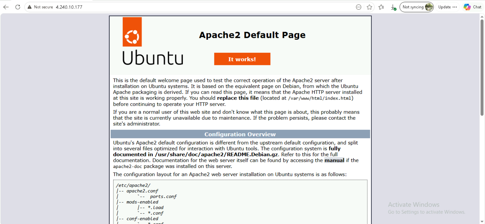
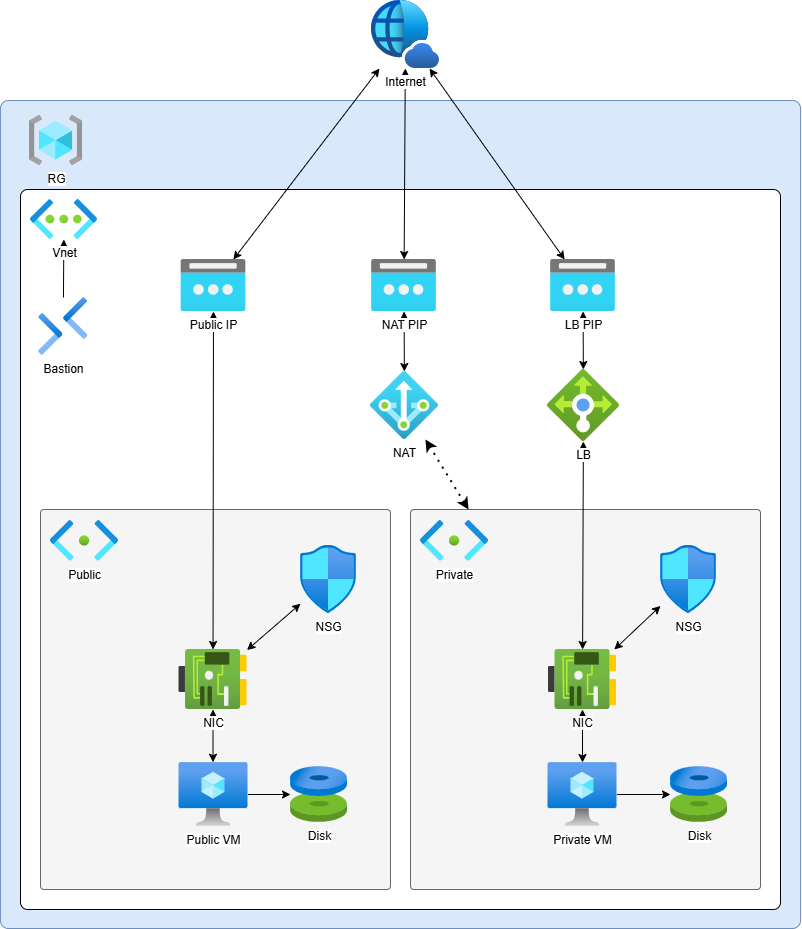

# Day 6 - 12-5-2026

## Outputs

```powershell
Apply complete! Resources: 23 added, 0 changed, 0 destroyed.

Outputs:

private-ip = "10.0.2.4"
private-nic-id = "/subscriptions/99468051-3b1c-4cf6-b8e1-610916356e9b/resourceGroups/sinan-rg/providers/Microsoft.Network/networkInterfaces/private-nic"
private-subnet-id = "/subscriptions/99468051-3b1c-4cf6-b8e1-610916356e9b/resourceGroups/sinan-rg/providers/Microsoft.Network/virtualNetworks/sinan-vnet/subnets/private-subnet"
private-vm-id = "/subscriptions/99468051-3b1c-4cf6-b8e1-610916356e9b/resourceGroups/sinan-rg/providers/Microsoft.Compute/virtualMachines/private-vm"
public-ip = "4.240.57.24"
public-nic-id = "/subscriptions/99468051-3b1c-4cf6-b8e1-610916356e9b/resourceGroups/sinan-rg/providers/Microsoft.Network/networkInterfaces/public-nic"
public-subnet-id = "/subscriptions/99468051-3b1c-4cf6-b8e1-610916356e9b/resourceGroups/sinan-rg/providers/Microsoft.Network/virtualNetworks/sinan-vnet/subnets/public-subnet"
public-vm-id = "/subscriptions/99468051-3b1c-4cf6-b8e1-610916356e9b/resourceGroups/sinan-rg/providers/Microsoft.Compute/virtualMachines/public-vm"
rg-id = "/subscriptions/99468051-3b1c-4cf6-b8e1-610916356e9b/resourceGroups/sinan-rg"
vnet-id = "/subscriptions/99468051-3b1c-4cf6-b8e1-610916356e9b/resourceGroups/sinan-rg/providers/Microsoft.Network/virtualNetworks/sinan-vnet"
PS C:\Users\307468\Azure\terraform> 
```

we will get this page automatically after applying the terraform files. It shows the outputs that we defined in the outputs.tf file.



## Architecture

