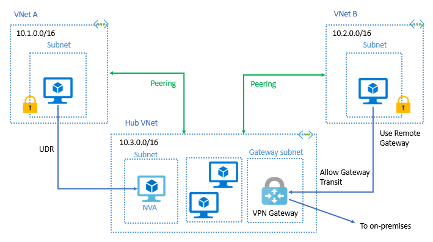

# Day 7 13-5-2026

1. what is vnet peering?
2. why we need vnet peering?
3. what is microsoft backbone infrastructure?
4. what is the real use case of vnet peering?
5. How Vlan works in layer 2 and layer 3?

## Answers

1. Vnet peering is a connection between two virtual networks in Azure that allows them to communicate with each other as if they were on the same network.
2. We need vnet peering to enable communication between virtual networks without the need for a VPN or an ExpressRoute connection. It allows resources in different virtual networks to communicate with each other securely and efficiently.
3. Microsoft backbone infrastructure refers to the global network of data centers and fiber optic cables that Microsoft uses to provide its cloud services. It is a high-speed, low-latency network that connects Microsoft's data centers around the world, allowing for fast and reliable communication between resources in different regions.
4. A real use case of vnet peering is when you have multiple virtual networks in different regions and you want to enable communication between them. For example, if you have a virtual network in the US and another virtual network in Europe, you can use vnet peering to allow resources in both virtual networks to communicate with each other without the need for a VPN or an ExpressRoute connection. This can be useful for scenarios such as disaster recovery, where you want to replicate data between virtual networks in different regions for redundancy and high availability.
5. VLAN (Virtual Local Area Network) works in layer 2 and layer 3 of the OSI model. In layer 2, VLANs are used to segment a physical network into multiple logical networks. Each VLAN is identified by a unique VLAN ID, and devices within the same VLAN can communicate with each other as if they were on the same physical network. In layer 3, VLANs can be used to route traffic between different VLANs using a router or a Layer 3 switch. This allows for communication between devices in different VLANs while still maintaining the logical separation of the networks.

## 7 Layers

- The OSI (Open Systems Interconnection) model is a conceptual framework that standardizes the functions of a communication system into seven layers. Each layer serves a specific purpose and interacts with the layers above and below it. The seven layers are:
  1. Physical Layer: This layer is responsible for the physical connection between devices, including the transmission of raw bits over a physical medium (e.g., cables, wireless signals).
  2. Data Link Layer: This layer is responsible for the reliable transfer of data between devices on the same network. It handles error detection and correction, as well as flow control. it uses MAC addresses to identify devices on the same network.
  3. Network Layer: This layer is responsible for routing data between different networks. It uses IP addresses to identify devices and determine the best path for data to travel from the source to the destination.
  4. Transport Layer: This layer is responsible for ensuring the reliable delivery of data between devices. It provides error recovery, flow control, and segmentation of data into smaller packets for transmission.
  5. Session Layer: This layer is responsible for establishing, managing, and terminating sessions between applications. It provides mechanisms for synchronization and dialog control.
  6. Presentation Layer: This layer is responsible for the translation of data between the application layer and the network. It handles data formatting, encryption, and compression to ensure that data is properly presented to the application layer.
  7. Application Layer: This layer is responsible for providing network services to applications. It includes protocols such as HTTP, FTP, and SMTP that enable communication between applications over the network.

| Layer | Function | Example Protocols | Devices | Data Unit |
| ----- | -------- | ----------------- | ------- | --------- |
| 7. Application | Provides network services to applications | HTTP, FTP, SMTP | Web browsers, email clients | Data |
| 6. Presentation | Translates data between application and network | SSL/TLS, JPEG, MPEG | Data formatters, encryption devices | Data |
| 5. Session | Manages sessions between applications | NetBIOS, RPC | Session managers | Data |
| 4. Transport | Ensures reliable delivery of data | TCP, UDP | Firewalls, load balancers | Segment |
| 3. Network | Routes data between networks | IP, ICMP | Routers, Layer 3 switches | Packet |
| 2. Data Link | Reliable transfer of data on the same network | Ethernet, PPP | Switches, bridges | Frame |
| 1. Physical | Physical connection between devices | Ethernet, Wi-Fi | Hubs, repeaters | Bits |

## Vnet Peering

- The network latency between virtual machines in peered virtual networks in the same region is the same as the latency within a single virtual network.
- The traffic between virtual machines in peered virtual networks is routed directly through the Microsoft backbone infrastructure, not through a gateway or over the public internet.
- You can apply network security groups in either virtual network to block access to other virtual networks or subnets.
- You can resize the address space of Azure virtual networks that are peered without incurring any downtime on the currently peered address space.
- **Service chaining** enables you to direct traffic from one virtual network to a virtual appliance or gateway in a peered network through user-defined routes (UDRs).
- Virtual network peering enables the next hop in a UDR to be the IP address of a virtual machine in the peered virtual network, or a VPN gateway.
- You can also configure the gateway in the peered virtual network as a transit point to an on-premises network.

- Both virtual network peering and global virtual network peering support gateway transit.